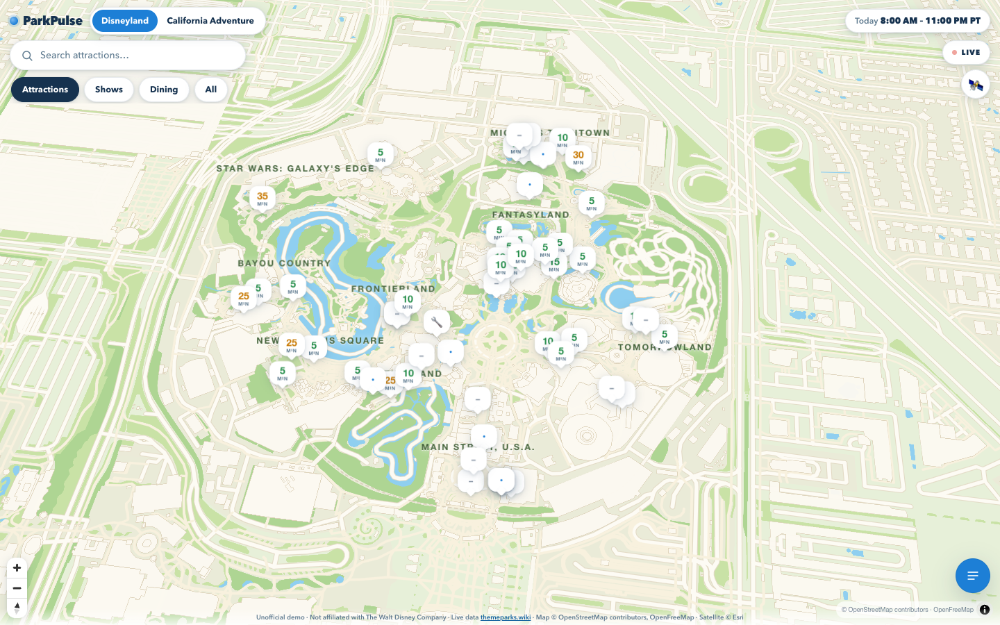

# ParkPulse

**A live, interactive map of the Disneyland Resort and Disneyland Paris — real attractions, real-time wait times, real satellite imagery, and GPS walking directions.**

What this proves: I can ship a polished, data-dense live product experience — the Disney Experiences app's map, rebuilt as a fast, dependency-light web app against open live data.



## Features

- **Live wait times** for every attraction in Disneyland Park, Disney California Adventure, and Disneyland Park Paris, refreshed every 60 seconds, color-coded (green ≤ 20 min, amber 25–45, red 50+), with temporary-closure and refurbishment states
- **Illustrated park-app cartography**: a custom-styled vector basemap (OpenFreeMap/OpenMapTiles over MapLibre GL) — soft greens, cream walkways, white buildings, friendly water — in the visual language of in-park map apps, with pseudo-3D attraction buildings and footprints (the castle, Space Mountain, the monorail loop), hand-placed land labels, zoom-aware attraction labels, and a one-tap **satellite mode** (Esri World Imagery)
- **Resort-locked camera**: map bounds and zoom are clamped to the active resort — the map is the resort, not greater Anaheim (or greater Marne-la-Vallée)
- **120 real places** per park — attractions, entertainment, and dining — from the open themeparks.wiki API, each with exact coordinates
- **Detail cards**: a real photo and factual "about" blurb for 76 attractions (curated at build time from Wikipedia/Wikimedia Commons — freely licensed, hotlinked, credited), plus standby wait, operating status, Lightning Lane price & return window when offered, next showtimes, and a last-updated stamp — all in the active park's own time zone
- **Wait-time list** sorted longest-first, search, and category filters, mirroring the in-park app's mental model
- **GPS walking directions**: search an attraction, tap **Directions**, and get a live blue you-dot, a route line, and distance / walk time / compass heading that update as you move (`watchPosition`), plus a one-tap **Apple Maps** handoff for turn-by-turn; a **demo mode** pins "you" at the park gate so the flow can be tested from anywhere
- **Park switcher**: Disneyland ↔ California Adventure ↔ Disneyland Paris with a full data reload and fly-over (cross-resort switches fly across the Atlantic); the last-viewed park is remembered
- Today's real **park hours** in the header
- Zero build step, zero framework: three files of vanilla HTML/CSS/JS + MapLibre GL from a CDN

## Run it

Any static server works:

```bash
python3 -m http.server 4173
```

Then open http://localhost:4173. (Live data requires network; the API is CORS-open. Geolocation requires a secure context — `localhost` and HTTPS both qualify. Pushes to `main` deploy the site to GitHub Pages via `.github/workflows/deploy.yml`, so it runs on a phone at the Pages URL with full GPS.)

## Architecture notes

- `themeparks.wiki` provides `children` (entity catalog + coordinates), `live` (status/queues/showtimes), and `schedule` (hours) per park — joined client-side by entity id; DOM markers update in place on each refresh, so pins never flicker
- The illustrated style is ~12 hand-authored MapLibre layers against OpenMapTiles vector tiles — no style server, no API key; satellite mode swaps the full style object while DOM markers persist
- The map deliberately avoids the `load` event as a readiness gate (raster tile streams can defer it indefinitely) and instead treats data, markers, and camera as independent of style readiness; a viewport-stability check makes the intro fly-in robust inside embedded webviews
- Land labels and the "nearest land" attribution on detail cards are hand-placed anchors — the public API doesn't expose land grouping
- Disneyland Paris's entity id is verified lazily: if the bundled UUID ever fails, the app resolves the real one from the API's `/destinations` index and retries — the park config self-heals
- The directions route line lives in the map style (which `setStyle` wipes on satellite toggle), so it re-adds itself on `style.load`; the you-dot is a DOM marker and survives style swaps for free
- `data/resort.geojson` (~2.6 MB) is full-detail resort geometry — 77 attraction footprints, 5,700 buildings with heights, plazas, ride tracks, the monorail and Disneyland Railroad — fetched once from OpenStreetMap via Overpass and bundled; rendered as pseudo-3D `fill-extrusion` volumes so attractions are *visible*, not just pinned (ODbL, credited); 113 structures carry real-world colors — a hand-curated palette for the marquee rides (rust Big Thunder, pink castle, white Space Mountain) plus OSM `building:colour` tags where mappers recorded them

## Data & IP

> Unofficial, non-commercial portfolio project. Not affiliated with, endorsed by, or sponsored by The Walt Disney Company. Attraction, land, and park names appear as factual data. Live data courtesy of the open [themeparks.wiki](https://themeparks.wiki) API. Imagery © Esri, Maxar, Earthstar Geographics. No Disney-owned assets are included in this repository.

## License

MIT — see [LICENSE](LICENSE).
